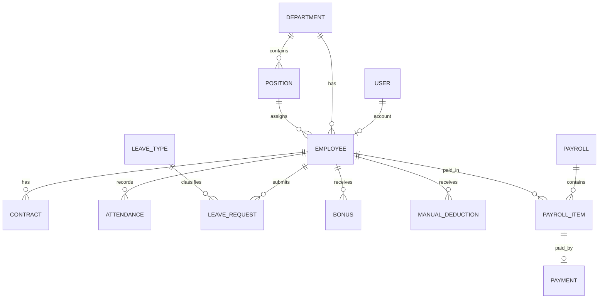

# HRFlow — Lean Entity Relationship Design

`business-rules.md` is authoritative. This document defines only the minimum data shape and constraints required by the seven-day MVP. `database/neon_schema.sql` is the executable PostgreSQL representation of this design.

## 1. Model Summary

| App | Model | Essential fields or purpose |
|---|---|---|
| accounts | User/Group | Django authentication and the Admin, HR Manager, Payroll Officer, and Employee roles |
| employees | Department | `name`, timestamps; support-data management may use Django Admin |
| employees | Position | `department`, `title`, `is_active` |
| employees | Employee | optional `user`, unique `employee_number`, name/email, department, position, hire date, `is_active` |
| employees | Contract | employee, dates, basic salary, fixed allowances, working hours/day, status |
| attendance | Attendance | employee, local date, check-in/out, worked/overtime hours, status |
| attendance | LeaveType | name, `is_paid`, `is_active`; seed the MVP values |
| attendance | LeaveRequest | employee/type, dates, derived requested days, status, approver/time |
| payroll | Bonus | employee, amount, effective date, status, creator/time |
| payroll | ManualDeduction | employee, amount, effective date, status, creator/time |
| payroll | TaxBracket | min/max, percentage, fixed amount, `is_active`; seed the demonstrative rule |
| payroll | Payroll | month/year, derived period dates, currency, status, totals, workflow actors/times |
| payroll | PayrollItem | employee/payroll snapshot containing all calculation inputs and results |
| payroll | Payment | payroll item, exact amount, date/method/reference, completed status, creator/time |

A payslip is a printable view rendered from `PayrollItem`; a separate Payslip database model is not required for the MVP.

## 2. Required Database Constraints

- `Employee.employee_number` is unique.
- At most one active `Contract` exists per employee.
- `(Attendance.employee, Attendance.date)` is unique.
- Pending or approved leave requests for one employee cannot overlap; enforce in validation and tests.
- `(Payroll.month, Payroll.year)` is unique.
- `(PayrollItem.payroll, PayrollItem.employee)` is unique.
- `Payment.payroll_item` is unique because the MVP supports one full payment only.
- Money fields use `DecimalField`; negative values are rejected.
- Contract and leave end dates cannot precede their start dates.

## 3. PayrollItem Snapshot

The snapshot must include at least:

- currency and calculation version;
- basic salary and fixed allowances;
- overtime hours and amount;
- bonus amount;
- absence and unpaid-leave days and deductions;
- manual deduction and tax amounts;
- gross salary, total deductions, and net salary.

Historical payslips read these saved values and never current contract values.

## 4. Public Dependency Direction

```text
accounts -> employees -> attendance -> payroll
```

Payroll may call public attendance services such as:

```python
get_employee_overtime_hours(employee, start_date, end_date)
get_absence_days(employee, start_date, end_date)
get_unpaid_leave_days(employee, start_date, end_date)
```

Attendance must not import payroll or calculate monetary values.

## 5. Relationships


