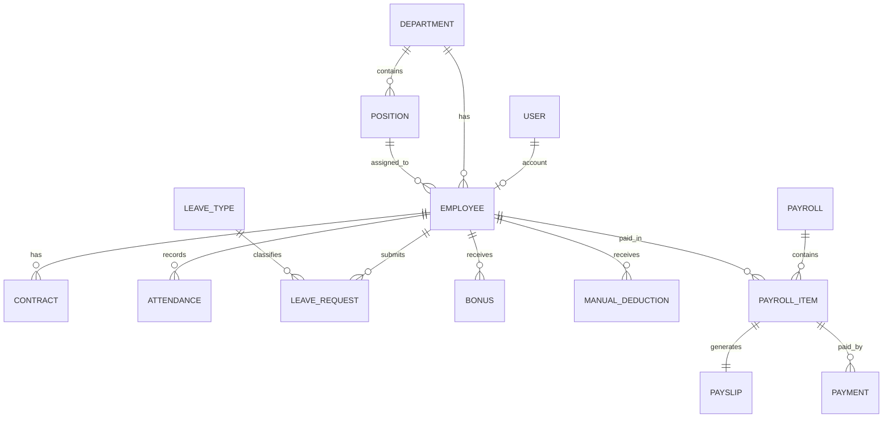

# HR & Payroll Management System — ERD

## 1. ERD Principles

The database should separate:

- HR master data
- attendance facts
- leave facts
- financial adjustments
- payroll snapshots

Attendance describes what happened. Payroll determines the financial consequence.

## 2. Core Entities

### User

Use Django authentication.

Important concepts:

- username/email
- password
- groups
- permissions
- active status

Recommended roles:

- Admin
- HR Manager
- Payroll Officer
- Employee

## 3. Employee Domain

### Department

```text
Department
-------------------------
id PK
name UNIQUE
description NULL
manager_id FK -> Employee NULL
created_at
updated_at
```

### Position

```text
Position
-------------------------
id PK
department_id FK -> Department
title
code NULL
description NULL
min_salary NULL
max_salary NULL
is_active
created_at
updated_at
```

Recommended unique constraint:

```text
(department_id, title)
```

### Employee

```text
Employee
-------------------------
id PK
user_id FK -> User NULL UNIQUE
employee_number UNIQUE
first_name
last_name
email UNIQUE
phone NULL
date_of_birth NULL
address NULL
hire_date
department_id FK -> Department NULL
position_id FK -> Position NULL
employment_status
bank_name NULL
bank_account_number NULL
is_active
created_at
updated_at
```

### Contract

```text
Contract
-------------------------
id PK
employee_id FK -> Employee
contract_type
start_date
end_date NULL
basic_salary
allowances_default DEFAULT 0
working_hours_per_day
working_days_per_week
probation_end_date NULL
status
created_at
updated_at
```

Business rule:

An employee can have contract history, but only one active contract at a time.

## 4. Attendance Domain

### Attendance

```text
Attendance
-------------------------
id PK
employee_id FK -> Employee
date
check_in NULL
check_out NULL
worked_hours DEFAULT 0
overtime_hours DEFAULT 0
status
notes NULL
created_at
updated_at
```

Required unique constraint:

```text
(employee_id, date)
```

Suggested statuses:

- present
- absent
- late
- leave
- holiday
- weekend

Important rule:

Store hours here, not monetary overtime values.

### LeaveType

```text
LeaveType
-------------------------
id PK
name UNIQUE
annual_allowance
is_paid
requires_approval
is_active
```

### LeaveRequest

```text
LeaveRequest
-------------------------
id PK
employee_id FK -> Employee
leave_type_id FK -> LeaveType
start_date
end_date
requested_days
reason NULL
status
approved_by_id FK -> User NULL
approved_at NULL
created_at
updated_at
```

Statuses:

- pending
- approved
- rejected
- cancelled

## 5. Payroll Input Entities

### Bonus

```text
Bonus
-------------------------
id PK
employee_id FK -> Employee
bonus_type
amount
effective_date
description NULL
status
created_by_id FK -> User NULL
created_at
updated_at
```

### ManualDeduction

```text
ManualDeduction
-------------------------
id PK
employee_id FK -> Employee
deduction_type
amount
effective_date
description NULL
status
created_by_id FK -> User NULL
created_at
updated_at
```

Examples:

- loan
- insurance
- advance repayment
- disciplinary
- other

Do not use this entity for absence/unpaid-leave calculations. Those are derived during payroll processing.

### TaxBracket

```text
TaxBracket
-------------------------
id PK
name
min_amount
max_amount NULL
percentage
fixed_amount DEFAULT 0
is_active
created_at
updated_at
```

For the MVP, tax rules are demonstrative and configurable, not a claim of legal compliance.

## 6. Payroll Entities

### Payroll

Represents one payroll run for a period.

```text
Payroll
-------------------------
id PK
period_start
period_end
month
year
status
total_gross DEFAULT 0
total_deductions DEFAULT 0
total_net DEFAULT 0
created_by_id FK -> User
reviewed_by_id FK -> User NULL
approved_by_id FK -> User NULL
created_at
reviewed_at NULL
approved_at NULL
```

Recommended unique constraint:

```text
(month, year)
```

If multi-company support is added later, use `(company, month, year)` instead.

### PayrollItem

One employee snapshot inside one payroll.

```text
PayrollItem
-------------------------
id PK
payroll_id FK -> Payroll
employee_id FK -> Employee
basic_salary
allowances
overtime_hours
overtime_amount
bonus_amount
gross_salary
absence_days
absence_deduction
unpaid_leave_days
unpaid_leave_deduction
manual_deduction_amount
tax_amount
total_deductions
net_salary
created_at
updated_at
```

Required unique constraint:

```text
(payroll_id, employee_id)
```

PayrollItem is a historical snapshot. Do not dynamically recalculate old payroll items from current contracts.

### Payslip

```text
Payslip
-------------------------
id PK
payroll_item_id FK -> PayrollItem UNIQUE
file NULL
generated_at
```

### Payment

```text
Payment
-------------------------
id PK
payroll_item_id FK -> PayrollItem
amount
payment_date
payment_method
reference_number NULL
status
created_by_id FK -> User NULL
created_at
```

Suggested statuses:

- pending
- completed
- failed
- cancelled

## 7. Main Relationships

```text
Department 1 --- N Position
Department 1 --- N Employee
Position   1 --- N Employee
Employee   1 --- N Contract
Employee   1 --- N Attendance
Employee   1 --- N LeaveRequest
LeaveType  1 --- N LeaveRequest
Employee   1 --- N Bonus
Employee   1 --- N ManualDeduction
Payroll    1 --- N PayrollItem
Employee   1 --- N PayrollItem
PayrollItem 1 --- 1 Payslip
PayrollItem 1 --- N Payment
```

## 8. Mermaid ERD



## 9. Dependency Flow

```text
Department / Position
        ↓
     Employee
        ↓
     Contract
        ↓
Attendance + Leave + Bonus + Manual Deduction + Tax
        ↓
     Payroll
        ↓
   PayrollItem
      ↓    ↓
 Payslip  Payment
```
