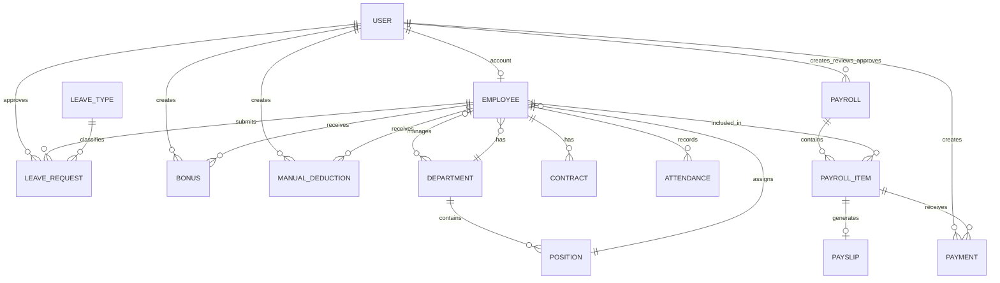

# HRFlow — Current Database Schema

This document describes the clean-database state produced by every checked-in Django migration. It is a current implementation reference, not a substitute for the target behavior in `business-rules.md`.

The only executable schema sources are:

- Django's built-in migrations;
- `accounts/migrations/0001_seed_role_groups.py`;
- `employees/migrations/0001_initial.py`;
- `attendance/migrations/0001_initial.py`;
- `payroll/migrations/0001_initial.py`.

Do not create or maintain a parallel SQL schema. When models change, create and review a new migration and update this document in the same task.

## 1. Conventions

- Every custom model has a `BigAutoField` primary key named `id`.
- `decimal(p,s)` means Django `DecimalField(max_digits=p, decimal_places=s)` and PostgreSQL `numeric(p,s)`.
- `?` marks a nullable field; quoted values after `=` are ORM defaults.
- `created_at` uses `auto_now_add`; `updated_at` uses `auto_now`.
- With `USE_TZ=True`, Django stores date-times as timezone-aware PostgreSQL timestamps.
- Foreign keys are indexed automatically. Unique fields, one-to-one fields, and unique constraints also create indexes.
- Django field `choices` provide application validation/display metadata; they are not PostgreSQL check constraints.
- `PROTECT` and `SET_NULL` below describe Django deletion behavior.

## 2. Django authentication and framework tables

There is no custom user model and no `accounts_*` user table. The project uses Django's standard:

- `auth_user`, `auth_group`, `auth_permission`, and their join tables;
- `django_session` for logged-in sessions;
- `django_admin_log`, `django_content_type`, and `django_migrations`.

The accounts migration creates these group names only; it does not assign permissions:

- `Admin`
- `HR Manager`
- `Payroll Officer`
- `Employee`

Supabase hosts these PostgreSQL tables. The application does not use Supabase Auth's `auth.users` table.

## 3. Employees app

### `employees_department`

```text
name             varchar(150), unique
description      text = ""
manager          FK -> Employee?, SET_NULL, related_name=departments_managed
created_at       datetime
updated_at       datetime
```

Default ordering: `name`.

### `employees_position`

```text
department       FK -> Department, PROTECT, related_name=positions
title            varchar(150)
code             varchar(50) = ""
description      text = ""
min_salary       decimal(12,2)?
max_salary       decimal(12,2)?
is_active        boolean = true
created_at       datetime
updated_at       datetime
```

Constraint: unique `(department, title)` as `position_unique_department_title`.

Default ordering: department name, then title.

### `employees_employee`

```text
user                  one-to-one -> auth.User?, SET_NULL, related_name=employee_profile
employee_number       varchar(30), unique
first_name            varchar(100)
last_name             varchar(100)
email                 varchar(254), unique
phone                 varchar(30) = ""
date_of_birth         date?
address               text = ""
hire_date             date
department            FK -> Department?, SET_NULL, related_name=employees
position              FK -> Position?, SET_NULL, related_name=employees
employment_status     varchar(20) = "active"
bank_name             varchar(150) = ""
bank_account_number   varchar(50) = ""
is_active             boolean = true
created_at            datetime
updated_at            datetime
```

Employment-status choices: `active`, `inactive`, `terminated`.

Default ordering: last name, then first name.

### `employees_contract`

```text
employee                 FK -> Employee, PROTECT, related_name=contracts
contract_type            varchar(30) = "full_time"
start_date               date
end_date                 date?
basic_salary             decimal(12,2)
allowances_default       decimal(12,2) = 0
working_hours_per_day    decimal(4,2) = 8
working_days_per_week    positive small integer = 5
probation_end_date       date?
status                   varchar(20) = "active"
created_at               datetime
updated_at               datetime
```

Contract-type choices: `full_time`, `part_time`, `contract`, `probation`.

Status choices: `active`, `inactive`, `terminated`.

Database constraints:

- partial unique `(employee)` where `status = "active"`;
- `end_date` is null or is on/after `start_date`;
- `basic_salary >= 0`;
- the positive field type adds `working_days_per_week >= 0`.

Default ordering: newest start date first.

## 4. Attendance app

### `attendance_attendance`

```text
employee          FK -> Employee, PROTECT, related_name=attendance_records
date              date
check_in          time?
check_out         time?
worked_hours      decimal(5,2) = 0
overtime_hours    decimal(5,2) = 0
status            varchar(20) = "present"
notes             text = ""
created_at        datetime
updated_at        datetime
```

Status choices: `present`, `absent`, `late`, `leave`, `holiday`, `weekend`.

Database constraints:

- unique `(employee, date)`;
- if both times exist, `check_out > check_in`;
- `worked_hours >= 0`;
- `overtime_hours >= 0`.

Default ordering: newest date first.

### `attendance_leavetype`

```text
name                 varchar(100), unique
annual_allowance     positive integer = 0
is_paid              boolean = true
requires_approval    boolean = true
is_active            boolean = true
```

The positive field type adds `annual_allowance >= 0`. This model has no timestamp fields.

Default ordering: name.

### `attendance_leaverequest`

```text
employee          FK -> Employee, PROTECT, related_name=leave_requests
leave_type        FK -> LeaveType, PROTECT, related_name=leave_requests
start_date        date
end_date          date
requested_days    decimal(5,2) = 0, non-editable in generated model forms
reason            text = ""
status            varchar(20) = "pending"
approved_by       FK -> auth.User?, SET_NULL, related_name=leave_requests_approved
approved_at       datetime?
created_at        datetime
updated_at        datetime
```

Status choices: `pending`, `approved`, `rejected`, `cancelled`.

Database constraints:

- `end_date >= start_date`;
- `requested_days >= 0`.

There is currently no leave-overlap exclusion constraint.

Default ordering: newest start date first.

## 5. Payroll app

### `payroll_bonus`

```text
employee          FK -> Employee, PROTECT, related_name=bonuses
bonus_type        varchar(50) = ""
amount            decimal(12,2)
effective_date    date
description       text = ""
status            varchar(20) = "active"
created_by        FK -> auth.User?, SET_NULL, related_name=bonuses_created
created_at        datetime
updated_at        datetime
```

Status choices: `active`, `cancelled`. Constraint: `amount >= 0`. Default ordering: newest effective date first.

### `payroll_manualdeduction`

```text
employee          FK -> Employee, PROTECT, related_name=manual_deductions
deduction_type    varchar(30) = "other"
amount            decimal(12,2)
effective_date    date
description       text = ""
status            varchar(20) = "active"
created_by        FK -> auth.User?, SET_NULL, related_name=manual_deductions_created
created_at        datetime
updated_at        datetime
```

Deduction-type choices: `loan`, `insurance`, `advance_repayment`, `disciplinary`, `other`.

Status choices: `active`, `cancelled`. Constraint: `amount >= 0`. Default ordering: newest effective date first.

### `payroll_taxbracket`

```text
name             varchar(100)
min_amount       decimal(12,2)
max_amount       decimal(12,2)?
percentage       decimal(5,2)
fixed_amount     decimal(12,2) = 0
is_active        boolean = true
created_at       datetime
updated_at       datetime
```

Database constraints:

- `min_amount >= 0`;
- `percentage >= 0`;
- `max_amount` is null or `max_amount >= min_amount`.

Default ordering: minimum amount.

### `payroll_payroll`

```text
period_start       date
period_end         date
month              positive small integer
year               positive small integer
status             varchar(20) = "draft"
total_gross        decimal(14,2) = 0
total_deductions   decimal(14,2) = 0
total_net          decimal(14,2) = 0
currency_code      varchar(3) = "USD"
created_by         FK -> auth.User, PROTECT, related_name=payrolls_created
reviewed_by        FK -> auth.User?, SET_NULL, related_name=payrolls_reviewed
approved_by        FK -> auth.User?, SET_NULL, related_name=payrolls_approved
created_at         datetime
reviewed_at        datetime?
approved_at        datetime?
```

Status choices: `draft`, `calculated`, `reviewed`, `approved`, `paid`.

Constraint: unique `(month, year)`. Positive field types require nonnegative month/year but do not enforce valid calendar ranges. `USD` is a schema default only; Q-002 is still pending.

Default ordering: newest year and month first.

### `payroll_payrollitem`

```text
payroll                       FK -> Payroll, PROTECT, related_name=items
employee                      FK -> Employee, PROTECT, related_name=payroll_items
basic_salary                  decimal(12,2)
allowances                    decimal(12,2) = 0
overtime_hours                decimal(5,2) = 0
overtime_amount               decimal(12,2) = 0
bonus_amount                  decimal(12,2) = 0
gross_salary                  decimal(12,2) = 0
absence_days                  decimal(5,2) = 0
absence_deduction             decimal(12,2) = 0
unpaid_leave_days             decimal(5,2) = 0
unpaid_leave_deduction        decimal(12,2) = 0
manual_deduction_amount       decimal(12,2) = 0
tax_amount                    decimal(12,2) = 0
total_deductions              decimal(12,2) = 0
net_salary                    decimal(12,2) = 0
created_at                    datetime
updated_at                    datetime
```

Constraint: unique `(payroll, employee)`. There are currently no nonnegative checks or database immutability trigger on this table.

Default ordering: payroll, then employee.

### `payroll_payslip`

```text
payroll_item     one-to-one -> PayrollItem, PROTECT, related_name=payslip
file             file/varchar(100)?, upload_to="payslips/"
generated_at     datetime
```

This table stores optional generated-file metadata. The authoritative monetary values remain on `PayrollItem`.

### `payroll_payment`

```text
payroll_item       FK -> PayrollItem, PROTECT, related_name=payments
amount             decimal(12,2)
payment_date       date
payment_method     varchar(30) = ""
reference_number   varchar(100) = ""
status             varchar(20) = "pending"
created_by         FK -> auth.User?, SET_NULL, related_name=payments_created
created_at         datetime
```

Status choices: `pending`, `completed`, `failed`, `cancelled`. Constraint: `amount >= 0`.

`payroll_item` is currently a normal foreign key, so the database permits multiple payments per payroll item.

Default ordering: newest payment date first.

## 6. Relationships



## 7. Known gaps against target business rules

These are documentation of current gaps, not authorization to implement them outside an approved task.

| Target rule | Current migration state |
|---|---|
| Pending/approved leave requests cannot overlap | No model validation or PostgreSQL exclusion constraint exists yet |
| One full payment per payroll item | `Payment.payroll_item` allows multiple rows; exact-net/approved-payroll rules are not enforced |
| PayrollItem is a complete immutable snapshot | No currency, calculation version, contract identity/rate details, or database immutability enforcement |
| Negative monetary values are rejected | Checks exist only for selected fields; many totals/snapshot amounts lack checks |
| Period dates derive from month/year | Dates are stored directly; calendar consistency is not constrained |
| Role permissions are enforced | Group names exist, but permissions and object-level rules are not assigned |
| Currency policy is confirmed | `currency_code` defaults to `USD`, but Q-002 remains pending |
| Payslip is only a rendered concept | A one-to-one `Payslip` file-metadata model currently exists |

Resolve each gap through a task brief, model/service changes, migrations where necessary, tests, and a documentation update. Do not alter pending business policy without recorded owner approval.
